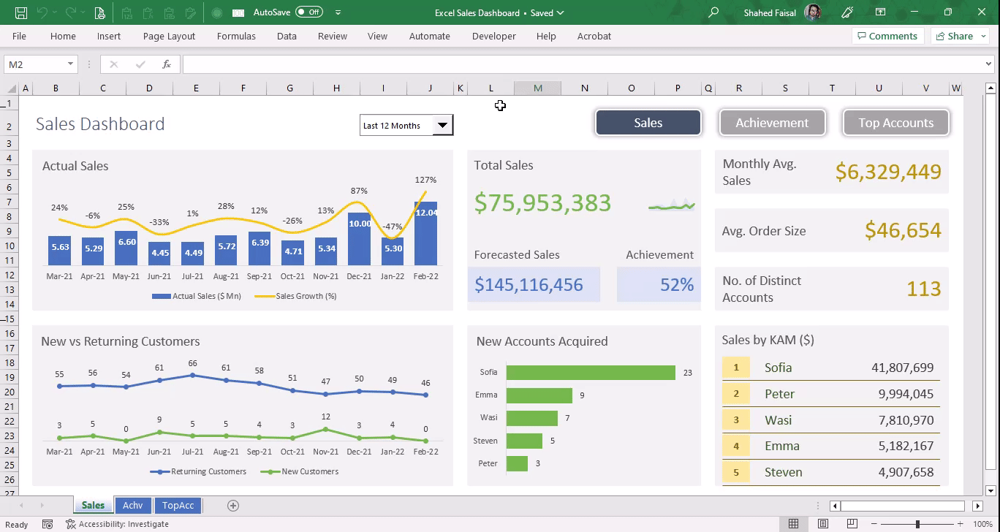

# Excel Dashboard

The goal of this project is to showcase management reporting dashboards prepared using built-in Excel functions, advanced charting techniques and tools (i.e. Power Query).

## Sales Dashboard

This interactive dashboard shows sales trends and KPIs for a B2B company including sales revenue and growth, new vs. returning customers, forecast vs. actual sales, target achievement, top customers' contribution to revenue, and the performance of Key Account Managers (KAM).

The data is aggregated and cleaned using Power Query which also adds the ability to append future data with minimal effort. Then it is analyzed and prepared using Excel functions such as IF, SUMIF, COUNTIF, INDEX, MATCH, OFFSET, EDATE, AGGREGATE etc. and visualized using dynamic charting techniques.

